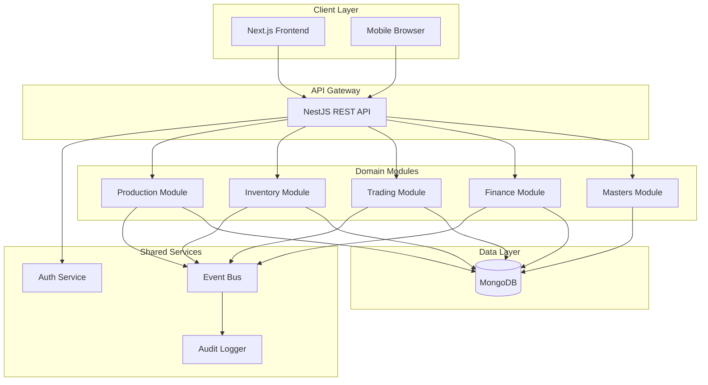
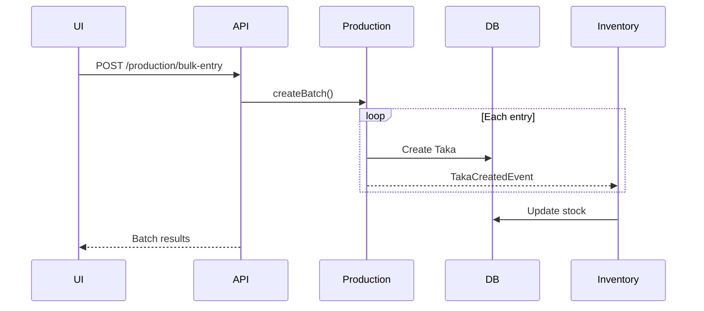
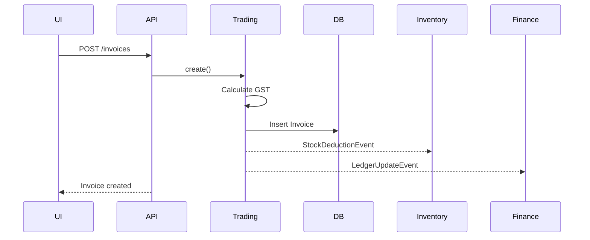
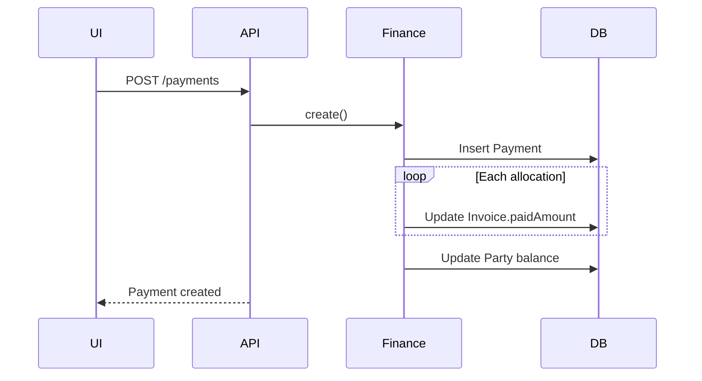

# Stock Management System Architecture Document

> **Version:** 1.0  
> **Last Updated:** 2026-01-09  
> **Status:** Draft

---

## Introduction

This document outlines the overall project architecture for **Stock Management System** (Textile Manufacturing & Trading), including backend systems, shared services, and non-UI specific concerns. Its primary goal is to serve as the guiding architectural blueprint for AI-driven development, ensuring consistency and adherence to chosen patterns and technologies.

**Relationship to Frontend Architecture:**
A separate Frontend Architecture Document (`docs/ui-architecture.md`) exists and details the frontend-specific design. Core technology stack choices documented herein are definitive for the entire project.

### Starter Template

- **Decision:** Use NestJS CLI (`@nestjs/cli`) as the starter template
- **Rationale:** Standard enterprise structure, built-in testing, excellent DI support

### Change Log

| Date       | Version | Description                   | Author    |
| ---------- | ------- | ----------------------------- | --------- |
| 2026-01-09 | 1.0     | Initial architecture document | Architect |

---

## High Level Architecture

### Technical Summary

The Stock Management System employs a **modular monolith architecture** built on NestJS, designed to handle textile manufacturing workflows (Yarn → Beam → Taka), inventory tracking with dual UOM enforcement, trading operations, and bill-by-bill financial settlements. The system uses MongoDB for flexible document storage suited to the varied entity structures, with a RESTful API layer serving the Next.js frontend. Core patterns include Repository Pattern for data access, Domain-Driven Design for business logic organization, and Event-based internal communication for cross-module operations.

### High Level Overview

| Aspect                   | Decision                                  | Rationale                                            |
| ------------------------ | ----------------------------------------- | ---------------------------------------------------- |
| **Architectural Style**  | Modular Monolith                          | Single deployable unit with clear module boundaries  |
| **Repository Structure** | Monorepo                                  | Frontend (Next.js) + Backend (NestJS) in single repo |
| **Service Architecture** | Single NestJS Application                 | Domain modules within one service                    |
| **Primary Data Flow**    | REST API → Service → Repository → MongoDB | Standard request-response for CRUD                   |

### High Level Project Diagram



### Architectural and Design Patterns

| Pattern                     | Description                                 | Rationale                                 |
| --------------------------- | ------------------------------------------- | ----------------------------------------- |
| **Modular Monolith**        | Domain modules with explicit boundaries     | Balances simplicity with maintainability  |
| **Repository Pattern**      | Abstract data access via repository classes | Testability, decouples from Mongoose      |
| **Domain-Driven Design**    | Entities, Value Objects, Domain Services    | Complex domain benefits from rich model   |
| **CQRS-Lite**               | Separate read models for reports            | Optimized queries for dashboards          |
| **Event-Driven (Internal)** | NestJS EventEmitter for cross-module        | Decouples modules                         |
| **DTO Pattern**             | Validate/transform at API boundary          | Input validation, API contract separation |

---

## Tech Stack

### Cloud Infrastructure

| Aspect         | Selection                   |
| -------------- | --------------------------- |
| **Provider**   | Self-hosted / VPS (initial) |
| **Deployment** | Docker containers           |
| **Regions**    | India (single region)       |

### Technology Stack Table

| Category              | Technology      | Version      | Purpose               | Rationale                            |
| --------------------- | --------------- | ------------ | --------------------- | ------------------------------------ |
| **Language**          | TypeScript      | 5.3.x        | Primary language      | Strong typing, excellent tooling     |
| **Runtime**           | Node.js         | 20.x LTS     | JavaScript runtime    | LTS stability                        |
| **Backend Framework** | NestJS          | 10.x         | Application framework | Enterprise-ready, excellent DI       |
| **Database**          | MongoDB         | 7.x          | Primary data store    | Document model suits varied entities |
| **ODM**               | Mongoose        | 8.x          | MongoDB modeling      | Native NestJS integration            |
| **API Style**         | REST            | OpenAPI 3.0  | Client-server         | Simple, well-understood              |
| **Validation**        | class-validator | 0.14.x       | Request validation    | Decorator-based                      |
| **Auth**              | JWT + Passport  | 10.x / 0.7.x | Authentication        | Stateless auth                       |
| **Testing**           | Jest            | 29.x         | Unit & integration    | Default NestJS runner                |
| **E2E Testing**       | Supertest       | 6.x          | API testing           | Standard for NestJS                  |
| **Logging**           | Pino            | 8.x          | Structured logging    | Fast, JSON output                    |
| **Config**            | @nestjs/config  | 3.x          | Environment config    | Dotenv integration                   |
| **Documentation**     | Swagger         | 7.x          | API docs              | Auto-generated                       |

### Development Tools

| Tool                | Version             | Purpose    |
| ------------------- | ------------------- | ---------- | --------------------- |
| **Package Manager** | pnpm                | 8.x        | Dependency management |
| **Linting**         | ESLint              | 8.x        | Code quality          |
| **Formatting**      | Prettier            | 3.x        | Code style            |
| **Git Hooks**       | Husky + lint-staged | 9.x / 15.x | Pre-commit checks     |

---

## Data Models

### Quality

**Purpose:** Defines fabric product types with specifications

| Attribute  | Type    | Description               |
| ---------- | ------- | ------------------------- |
| `name`     | string  | Quality name              |
| `code`     | string  | Unique short code         |
| `reedPick` | string  | Reed/Pick specification   |
| `width`    | number  | Fabric width              |
| `weight`   | number  | Standard weight per meter |
| `isActive` | boolean | Soft delete flag          |

### Party (Customer/Supplier)

**Purpose:** Trading partners

| Attribute        | Type     | Description                |
| ---------------- | -------- | -------------------------- |
| `name`           | string   | Party name                 |
| `type`           | enum     | customer / supplier / both |
| `gstin`          | string   | GST number                 |
| `state`          | string   | State code for GST         |
| `address`        | embedded | Address details            |
| `openingBalance` | number   | Initial balance            |

### Beam (Logical Entity)

**Purpose:** Warp preparation unit

| Attribute        | Type     | Description                 |
| ---------------- | -------- | --------------------------- |
| `beamNo`         | string   | Sequential number           |
| `qualityId`      | ObjectId | Reference to Quality        |
| `expectedMeters` | number   | Target meters               |
| `actualMeters`   | number   | Produced meters             |
| `status`         | enum     | created / loaded / finished |

### Taka

**Purpose:** Production output with dual UOM

| Attribute | Type   | Description               |
| --------- | ------ | ------------------------- |
| `takaNo`  | number | Sequential number         |
| `type`    | enum   | grey / folded / rfd       |
| `meters`  | number | **REQUIRED** - Length     |
| `count`   | number | **REQUIRED** - Taka count |
| `weight`  | object | { gross, tare, net }      |
| `status`  | enum   | inStock / issued / sold   |

### Invoice

**Purpose:** Sales/Purchase document

| Attribute    | Type       | Description                    |
| ------------ | ---------- | ------------------------------ |
| `invoiceNo`  | string     | Unique number                  |
| `type`       | enum       | sales / purchase / salesReturn |
| `partyId`    | ObjectId   | Party reference                |
| `items`      | embedded[] | Line items with dual UOM       |
| `gst`        | object     | { cgst, sgst, igst }           |
| `paidAmount` | number     | Amount settled                 |
| `status`     | enum       | unpaid / partial / paid        |

### Payment

**Purpose:** Bill-by-bill settlement

| Attribute     | Type       | Description             |
| ------------- | ---------- | ----------------------- |
| `voucherNo`   | string     | Payment number          |
| `partyId`     | ObjectId   | Party reference         |
| `amount`      | number     | Total amount            |
| `allocations` | embedded[] | [{ invoiceId, amount }] |

---

## Components

### Domain Modules

| Module         | Responsibility         | Key Controllers                  |
| -------------- | ---------------------- | -------------------------------- |
| **Masters**    | Reference data CRUD    | Quality, Party, Factory, Worker  |
| **Production** | Manufacturing workflow | Yarn, Beam, Taka, BulkProduction |
| **Inventory**  | Stock tracking         | Stock, StockMovement             |
| **Trading**    | Sales operations       | SalesOrder, Invoice, SalesReturn |
| **Finance**    | Settlements            | Payment, Ledger, Salary          |

### Shared Infrastructure

| Module     | Responsibility                          |
| ---------- | --------------------------------------- |
| **Auth**   | JWT authentication, user management     |
| **Common** | Interceptors, pipes, validators, events |

---

## External APIs

**N/A** — Standalone system with no external integrations.

---

## Core Workflows

### Bulk Production Entry



### Sales Invoice with Stock Deduction



### Bill-by-Bill Payment



---

## Database Schema

### Key Collections & Indexes

| Collection  | Key Indexes                                              | Purpose                  |
| ----------- | -------------------------------------------------------- | ------------------------ |
| `qualities` | `{ code: 1 }` unique, `{ isActive: 1 }`                  | Lookup, filtering        |
| `parties`   | `{ type: 1, isActive: 1 }`                               | Customer/supplier filter |
| `takas`     | `{ factoryId: 1, qualityId: 1, status: 1 }`              | Stock queries            |
| `invoices`  | `{ partyId: 1, status: 1 }`, `{ status: 1, dueDate: 1 }` | Outstanding              |
| `beams`     | `{ status: 1, factoryId: 1 }`                            | Active beams             |

---

## Source Tree

```
stock-management-system/
├── apps/
│   ├── web/                    # Next.js Frontend
│   └── api/                    # NestJS Backend
│       ├── src/
│       │   ├── modules/
│       │   │   ├── auth/
│       │   │   ├── masters/
│       │   │   ├── production/
│       │   │   ├── inventory/
│       │   │   ├── trading/
│       │   │   └── finance/
│       │   ├── common/
│       │   └── config/
│       └── test/
├── packages/
│   └── shared/                 # Shared types
├── docs/
└── docker-compose.yml
```

---

## Infrastructure and Deployment

| Aspect           | Selection                           |
| ---------------- | ----------------------------------- |
| **IaC Tool**     | Docker Compose (dev), Docker (prod) |
| **CI/CD**        | GitHub Actions                      |
| **Environments** | Development → Staging → Production  |
| **Rollback**     | Docker image rollback, < 15 min RTO |

---

## Error Handling Strategy

| Aspect                  | Selection                                              |
| ----------------------- | ------------------------------------------------------ |
| **Error Model**         | NestJS HttpException hierarchy                         |
| **Logging**             | Pino 8.x, JSON structured                              |
| **Transactions**        | Mongoose sessions for multi-document                   |
| **Business Exceptions** | DualUomRequired, InsufficientStock, InvoiceAlreadyPaid |

---

## Coding Standards

### Critical Rules (AI MUST Follow)

| Rule                       | Description                                                |
| -------------------------- | ---------------------------------------------------------- |
| **Dual UOM Validation**    | All Taka/Invoice items MUST have both `meters` AND `takas` |
| **Use Logger**             | Never use `console.log` — inject Pino logger               |
| **Repository abstraction** | No direct Mongoose in controllers                          |
| **DTO Validation**         | All request bodies use class-validator DTOs                |
| **Soft deletes**           | Never hard delete masters — set `isActive: false`          |
| **Event emission**         | Cross-module writes use EventEmitter                       |

---

## Test Strategy

| Aspect            | Selection                                 |
| ----------------- | ----------------------------------------- |
| **Approach**      | Test-after, focus on critical paths       |
| **Unit Coverage** | 70% minimum                               |
| **Test Pyramid**  | Unit (70%) → Integration (25%) → E2E (5%) |
| **Framework**     | Jest 29.x, Supertest 6.x                  |

---

## Security

| Aspect                   | Selection                                |
| ------------------------ | ---------------------------------------- |
| **Authentication**       | JWT Bearer tokens                        |
| **Input Validation**     | class-validator at controller entry      |
| **Rate Limiting**        | 100 req/min per IP                       |
| **Secrets**              | Environment variables, never hardcoded   |
| **Logging Restrictions** | Never log passwords, GSTIN, payment refs |

---

## Next Steps

1. **Frontend Architecture** — Review `docs/ui-architecture.md` for UI-specific design
2. **Story Implementation** — Begin with Masters module (Quality CRUD)
3. **Infrastructure Setup** — Create Docker Compose for local development
